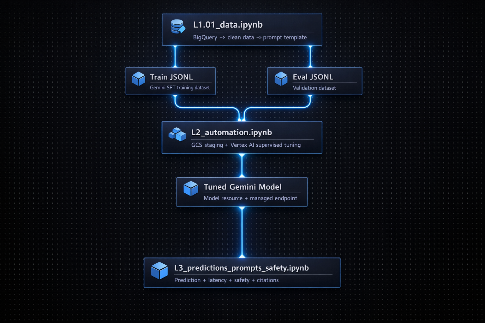
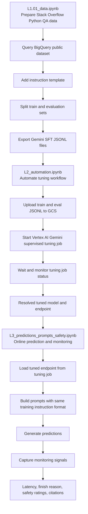

# LLMOps First Demo

This project demonstrates a simple production-style LLMOps workflow for preparing a tuning dataset, automating Gemini supervised fine-tuning, and serving predictions with prompt and safety monitoring on Vertex AI.

## Pipeline

## Notebook Roles

- [L1.01_data.ipynb](./L1.01_data.ipynb) prepares the supervised fine-tuning dataset from the Stack Overflow BigQuery public dataset, adds the instruction prompt format, and exports training and evaluation JSONL files.
- [L2_automation.ipynb](./L2_automation.ipynb) automates the Gemini supervised fine-tuning workflow on Vertex AI and produces the tuned model resource plus the managed endpoint used for serving.
- [L3_predictions_prompts_safety.ipynb](./L3_predictions_prompts_safety.ipynb) loads the tuned deployment, sends production-style prompts, and records monitoring signals such as latency, safety results, finish reason, and citation metadata.

## Production Flow Summary

1. Data is prepared and versioned in `L1.01_data.ipynb`.
2. The tuning job is launched and tracked in `L2_automation.ipynb`.
3. The tuned model endpoint is used for prediction and monitoring in `L3_predictions_prompts_safety.ipynb`.
